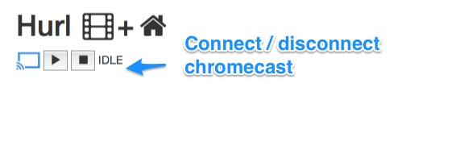

# Hurl

## About

Hurl is a simple and opinionated web-based media server for playing MP4 media files on
a Google [Chromecast](http:www.google.com/chromecast).

Hurl is basically a web application that uses the chromecast javascript sender API to
- connect/disconnect to/from a Google chromecast
- play, pause and stop mp4 media files

I based the chromecast sender javascript off of the sample CastHelloVideo-chrome app, so full credit to:
https://github.com/googlecast/CastHelloVideo-chrome

I also am using [Trakt](http://trakt.tv) for serving up images, thumbnails, descriptions, etc.
Trakt is awesome you should check it out http://trakt.tv.

## Prerequisites

 - A Chromecast
 - Google Chrome browser
 - Ruby 2.0.0+
 - Rails 4.0.0
 - a simple HTTP server (i.e. I am including a simple node-based http server)
 - A [Trakt](http://trakt.tv) account (you will get an API Key that we will use to fetch images, descriptions, etc.)
 - Media (i.e. your MP4 files)

### Convention
Remember when I said Hurl was opinionated? Well the reason is to provide some
reasonable structure and naming conventions so Hurl can fetch information about
media from [Trakt](http://trakt.tv).

Hurl reads information from a root directory that contains two different subdirectories for Movies and TV:

i.e.

    <SOME_DIR>/
      |-- Movies
      |-- TV

Within each directory you may have subdirectories, etc.

For example:

    <SOME_DIR>/
      |-- Movies
          |-- Fight Club/
              |-- Fight.Club.mp4
      |-- TV
          |-- Breaking Bad
              |-- Breaking.Bad.S01E02.mp4

Last note on "convention", since media information is fetched from [Trakt](http://trakt.tv)
it is advised to name movies, shows or episodes using the convention below so
it will provide the best information and provide better matches from Trakt.tv.

Movie names examples:

- Fight Club.mp4
- Fight.Club.mp4

TV Shows / Episodes examples:

- Breaking Bad S01E02.mp4
- Breaking.Bad.S01E02.mp4

Basically you dont want a bunch of extra crap in the file names.
Directory names don't matter much, its mainly the file names which are
used to derive information and fetch data from Trakt.tv.

## Setup

First step: clone the repository:

    git clone https://github.com/markstgodard/hurl.git
    cd hurl

### HTTP Server
Secondly we want to configure and run a simple HTTP server to serve
up our MP4 files.

Edit hurl/scripts/config.json

####For example:
This will serve up media from this root folder running on port 8000

    {
        "folder": "/Volumes/Data/Media",
          "port": 8000
    }

Install [node](http:node.js), install node packages (one time only) and then run the http server

    > cd scripts

Install node packages (one time only)

    > npm install

Run the server

    > node server.js
    Server running, listening on port: 8000

### Hurl web application
Now we want to run the web application that serves up media
and provides a minimal interface to connect to Chromecast
and play media files.

Edit hurl/config/hurlconfig.yml to set the ip of the
node http server (previous step) and the network accessible
share directory locations for "Movies" and "TV" shows
and your Trakt Api Key (you'll need to create an account on http://trakt.tv and
get an API key, its quick and painless)

    media_http_server: http://<ip address of http server>:8000/media
    movies_directory: /Volumes/Data/Media/Movies
    tv_directory: /Volumes/Data/Media/TV
    trakt_api_key: <Trakt API Key>

Run the web application

    > cd hurl
    > rails server

## Usage

Now that you are up and running goto: http://localhost:3000

First thing you will want to click the top play button to connect to
your Chromecast. Once you click the top Play button it will
prompt your Chrome browser to select and connect to your chromecast.
You can also at any time click to the top Stop button to disconnect
from the chromecast.

You need to do this before selecting a move to play.

After you are connected to your Chromecast, you should see a list of
movies and shows below. Each movie / show will have a Thumbnail
image, overview information, rating, year, genre, etc.

Each thumbnail will have a Play button on the top left corner.

For example:

### Notes

All media information is saved in Active Record entities
so information about movies, tv shows, etc is not fetched from Trakt.tv
every time.

However if you want to "force" refresh information you can simply
do a Media.delete_all, for example:

    > cd hurl
    > rails console
    Loading development environment (Rails 4.0.0)
    2.0.0-p247 :001 > Media.delete_all
    SQL (2.6ms)  DELETE FROM "media"
    => 28

### TODOs

 - Need to cleanup UI
 - add a box at the top right to set the image of the thumbnail of Now Watching
 - improve media lookup, less hacky / dependent on naming conventions
 - update tests to use VCR instead of hitting Trakt

## License

I based the chromecast / javascript off of the Google CastHelloVideo-chrome
sample application: https://github.com/googlecast/CastHelloVideo-chrome
which is under the Apache 2.0 License. This project is also under the Apache 2.0
license.
